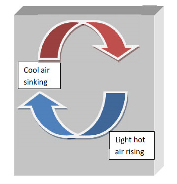

## Inroduction 

**Heat**

Heat can be defined as the transfer of energy across the boundary of a system due to a temperature difference between the system and its surroundings. Heat should not be confused with internal energy which is essentially all the energy of a system that is associated with its atoms and molecules - when viewed from a reference frame at rest with respect to the object. It's important to understand the fact that internal energy can undergo a change even when there is no transfer of heat. Consider an adiabatic vessel with a movable lid-pulling the lid, in such a manner that the volume of vessel expands, results in cooling and consequent decrease of internal energy even though there was no transfer of heat from surroundings.
           

## 1. Modes of Heat Transfer
Transfer of heat can take place through three different mechanisms
### 1.1 Conduction

Conduction can be understood as a process in which energy transfer occurs from a more energetic body to a less energetic process primarily due to collisions between them. Conduction takes only when there is a temperature difference between two parts of the conducting medium. Let's explore the dependence of the conduction rate with change in temperature. Consider a thin plate of thickness `Delta x` and cross sectional area A. Let the temperature of thickness at one face be and at the opposite face be . It has been experimentally found that heat flow will take place between the two faces. If the time interval is `Delta T` and the heat flow `Delta Q`, then it has been found that `(Delta Q)/(Delta T)=k(Delta T)/(Delta x)`
 ### 1.2 Convection               
Unlike conduction, convection involves bulk transport of fluids from one place to another which consequently results in exchange of heat from the hotter to colder substance. In brief, the heat energy transferred due to movement of a heated substance is convection. Land and sea breezes are a good example of the phenomenon of convection. During the night, the land cools faster due to poor conductivity of land. This leads to differential heating of the air above land and water. The air above seas is hotter. Since hot air is lighter, it rises up resulting in cool breezes from the land blowing in above seas and the hot air being transported to land resulting in warm night breezes. The reverse process is repeated during the day. This entire phenomenon is based on convection currents and is an example of natural convection. Natural convection is essentially due to the difference in the densities of the fluids which results in their subsequent motion. When fluids are made to move due to some external forces such as a fan or a blower as the case maybe, then it's called forced convection.
 

				

Figure 1.1 Convection Currents

                           
 ### 1.3 Radiation    
 Radiation heat exchange between two bodies at different temperatures always results in a net transfer of heat energy from the body at a higher temperature to the other at a lower temperature.Heat transfer by radiation is important role in many heating and cooling operation and equipment such as operation of a furnace ,thermal cracking, various types of kilns etc.Radiation heat loss from a process equipment becomes significant when its temperature is considerably different from that of the ambient. Therefore process of radiation is necessary for thermal calculation in a varity of physical situation. Thermal radiation is the emission of electromagnetic waves from all matter that has a temperature greater than absolute zero.Thermal radiation incident on a body tends to increase its temperature .Its depending upon the nature of the material constituting the body and its surface characteristics ,the incident radiation may be absorbed,reflected, or transmitted, partly or fully.
