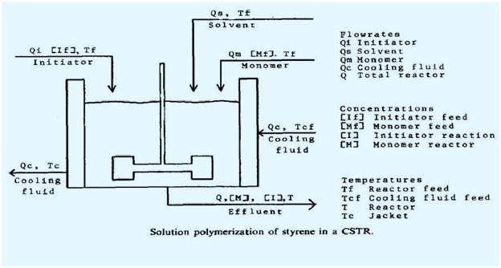

## Inroduction 

Styrene (vinyl benzene, styrene monomer SM) is a colorless to yellowish oily liquid with a distinctive aromatic odor. It is sparingly soluble in water but soluble in alcohols, ethers and carbon disulfide. It is chemically reactive and undergoes polymerization readily (by heat, light or peroxide catalysts). Polymerization results in volumetric shrinkage (17%) and exothermic heat (17.8 Kcal/mole).
The Process model for the free radical solution polymerization of styrene in a jacketed continuous stirred tank reactorreactor (CSTR) involves reaction kinetics, a material balance and an energy balance. The cooling jacket uses water as the cooling fluid to remove heat generated by exothermic polymerization.
           

**Steady-state:** It is a situation in which all state variables are constant despite parallel processes that strive to change them.  

**Quasi-steady-state:** It is also known as pseudo-steady-state, in this assumption the concentration of the intermediate complex does not change on the time scale of product formation.  

**Mass balance:** It is an analysis of system based on the application of conservation of mass, it is also known as material balance. 

**Energy balance:** It is first law of thermodynamics which states the law of conservation of energy, specialized by thermodynamical systems. 

**Rate expression:** For a chemical reaction, the equation that links the reaction rate with concentrations of reactants and constant parameters. 

**Arrhenius rate expression:** This is the formula which depicts the dependence if reaction rate constant with temperature. 

**Heat capacity:** It characterizes the amount of heat required to change a substance’s temperature by a given amount. 

**Schematic diagram:**
 

				
                          
 ### Assumptions
1. The lifetime of the polymer radical species is extremely short compares to other system time constants so that the quasi-steady-state approximation is valid.
2. The polymer propagation rate can be expressed by a single rate expression
3. The sum of thr Arrhenius rate expressions for termination by coupling and by disproportionation can be expressed as a single overall chain termination rate.
4. The concentration of polymer radicals is small relative to the concentration of initiated radicals.
5. The reactor is well mixed.
6. Kinetic and potential energy changes between inlet and outlet streams are negligible as is the shaft work of the agitator.
7. The mean heat capacities of the system and the overall heat transfer coefficient to the reactor jacket are constants.
8. The heats of initiation and termination are negligible compared to the heat of polymerization.

The model of polystyrene polymerization which results is:
$$\frac{d[I]}{dt}=(\frac{Q_i[I_f]-Q_t[I]}{V}-k_d[I] ) ..................(1)$$

$$\frac{d[M]}{dt}=(\frac{Q_m[M_f]-Q_t[M]}{V}-k_p[M][P])  ..................(2)$$

$$\frac{dT}{dt}=\frac{Q_t(T_f-T)}{V}+\frac{-\Delta H_r}{\rho C_p}\ X\ k_p[M][P]  $$

$$-\frac{ h_A}{\rho C_pV}\ X\ (T-T_c)   ..................(3)$$

$$\frac{dT_c}{dt}=\frac{Q_c(T_{cf}-T_c)}{V_c}+\frac{hA}{\rho_c C_{pc}V_c \ X\ (T-T_c)}  ..................(4)$$

$$[P]=[\frac{2fk_d[I]}{k_t}]^{1/2}  ..................(5)$$

 ### Exponential growth phase
 A = heat transfer area of CSTR,  
CD = mean heat capacity of reactor fluid,  
Cpc= heat capacity of cooling jacket fluid,  
f = initiator efficiency,  
h = overall heat transfer coefficient,  
[l] = concentration of initiator in reactor,  
[If] = concentration of initiatorinfeed,  
kd = Ad exp(−Ed/T)s−I (choi, 1986),  
kp = AP exp(− Et/T) l mol−1 s−1(Biesenberger and Sebastian, 1983),  
[M] = concentration of monomer in reactor,  
[Mf] = concentration of monomer in feed,  
Qi = flowrate of initiator stream,  
Qc= flowrate of cooling jacket fluid,  
Qm = flowrate of monomer stream,  
Qt= flowrate of exit stream( =Qi +QS +Qm),  
t = time, T = temperature of reactor,  
Tc = mixing cup temperature of cooling jacket fluid,  
Tcf = inlet temperature of cooling jacket fluid,  
Tf = temperature of reactor feed,  
V = reactor volume,  
Vc = volume of cooling jacket,  
-ΔHr = heat of polymerization reaction,  
ρ = mean density of reactor fluid,  
ρc = density of cooling jacket fluid.  

The various constants for the process model are given below:

Parameter | Process
------------- | -------------
f  | 0.6
Ad  | 5.95 x 1013
Ed | 14,897
At | 1.25 x 109
Et | 843
Ap | 1.06 x 107
Ep | 3557
-∆Hr | 16,700
hA | 60
ρCp | 370
ρCpc |980

